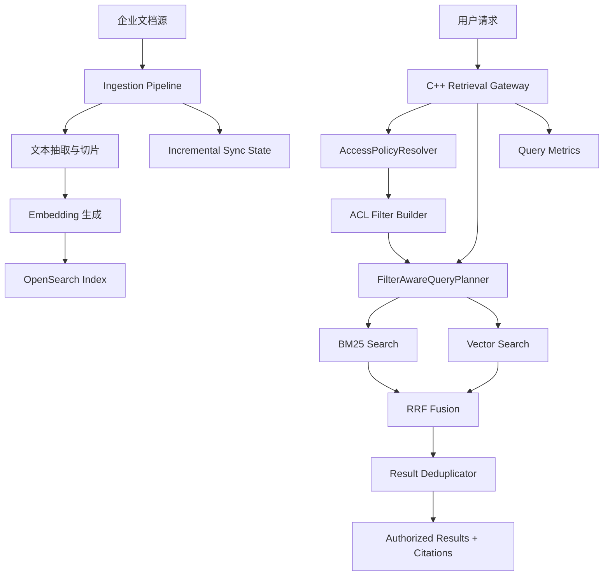
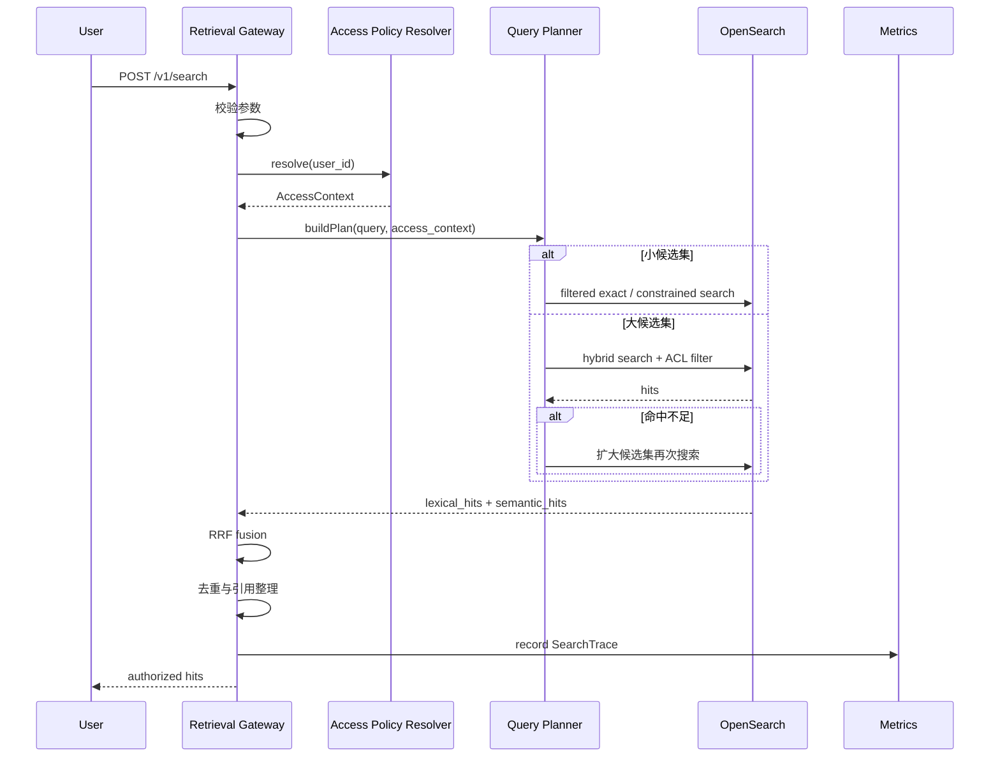
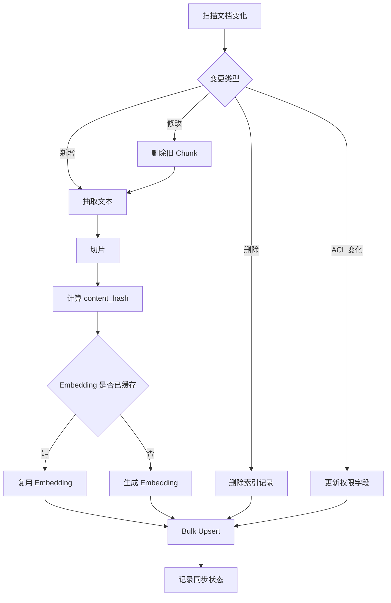
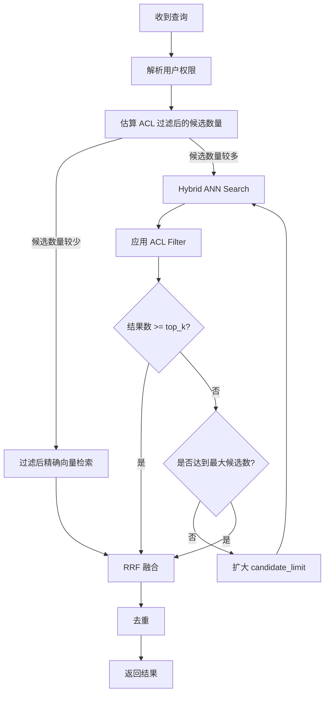

# EnterpriseRetrievalGateway 执行计划书

> 项目名称：**EnterpriseRetrievalGateway**  
> 项目定位：**面向企业知识库的权限感知混合检索服务**  
> 推荐仓库名：`enterprise-retrieval-gateway`  
> 核心语言：`C++17`  
> 基础设施：`OpenSearch`、`Docker Compose`、`Python` 数据处理脚本  
> 项目原则：**不重复造搜索引擎内核；重点解决企业检索中的权限、安全、效果、延迟和数据新鲜度问题。**

---

## 0. 一句话说明

企业内部文档很多，但员工真正需要的不是“能搜到一些东西”，而是：

```text
搜得准
看不到无权限内容
文档更新后能及时搜到
过滤条件很多时仍然稳定
结果能够解释
效果能够量化
线上问题能够定位
```

本项目实现一个 C++ 检索网关，在 OpenSearch 之上完成：

```text
权限解析
→ ACL Filter 注入
→ BM25 与向量检索并行执行
→ RRF 融合
→ 过滤感知查询规划
→ 结果去重
→ 引用返回
→ 指标记录
```

---

# 1. 项目解决的真实问题

## 1.1 企业场景

假设一家软件公司已经积累了：

```text
Engineering/
  API 文档
  部署手册
  故障复盘
  值班手册
  客户工单

Finance/
  报销制度
  合同
  财务报表

HR/
  请假制度
  晋升规则
  薪酬制度

Sales/
  产品报价
  客户方案
```

员工查询：

```text
“支付服务出现 E1027 应该怎么排查？”
```

系统必须同时满足：

```text
精确命中错误码 E1027
召回语义相近的故障复盘
只返回用户有权访问的文档
避免重复返回同一篇文档的多个相邻片段
记录检索链路耗时
给出原始文档引用
```

---

## 1.2 普通搜索为什么不够

### 只做关键词检索

优点：

```text
错误码
接口名
版本号
专有名词
```

容易准确命中。

缺点：

```text
表达方式变化后容易漏召回
```

例如：

```text
查询：支付接口超时
文档：下游交易链路长时间无响应
```

关键词不一致，但语义接近。

### 只做向量检索

优点：

```text
能够找到语义相近表达
```

缺点：

```text
错误码
订单号
版本号
缩写
内部接口名
```

容易被忽略。

### 正确方案

```text
BM25 关键词检索
+
向量语义检索
+
RRF 结果融合
```

---

## 1.3 企业权限问题

普通员工不能看到：

```text
财务报表
高管薪酬
其他客户合同
未授权项目资料
```

权限过滤必须由网关强制注入。

客户端不能自行关闭。

```text
用户请求
→ 解析身份
→ 获取部门、用户组、项目权限
→ 构造 ACL Filter
→ 执行检索
```

---

## 1.4 带过滤条件的向量检索为什么困难

向量检索通常先找到近邻，再应用过滤条件。

例如：

```text
ANN 先找到 100 条近邻
→ ACL Filter 过滤后只剩 2 条
→ 用户需要 Top 10
→ 返回结果数量不足
```

本项目实现：

```text
Filter-Aware Query Planner
```

根据过滤选择率切换：

```text
候选范围很小
→ 先过滤，再做精确向量检索

候选范围较大
→ ANN 检索，再应用过滤

ANN 过滤后结果不足
→ 动态扩大候选数量
→ 继续检索
```

---

# 2. 项目边界

## 2.1 必做功能

```text
文档导入
文档切片
Embedding 生成
BM25 检索
向量检索
混合检索
RRF 融合
文档级 ACL
ACL Filter 强制注入
过滤感知查询规划
结果去重
引用返回
文档新增、更新、删除
批量索引
查询日志
链路耗时指标
离线评测
benchmark
README
架构文档
```

## 2.2 可选增强

核心完成后再选择少量：

```text
Rerank
查询缓存
降级策略
Embedding 缓存
权限缓存
多租户隔离
Prometheus 指标导出
Grafana 面板
OpenTelemetry Trace
简单 RAG Demo
```

## 2.3 明确不做

```text
手写 HNSW
手写倒排索引
手写 BM25
手写分布式存储
手写向量数据库
Raft
分片副本
复杂 Web 前端
完整身份认证系统
完整 RAG 平台
多 Agent 编排
训练 Embedding 模型
```

原因：

```text
企业价值不在于重复实现成熟搜索引擎
而在于正确解决权限、召回、延迟、更新和评测问题
```

---

# 3. 技术选型

## 3.1 推荐技术栈

| 层级 | 技术 | 用途 |
|---|---|---|
| 网关 | C++17 | 核心业务逻辑 |
| HTTP | `cpp-httplib` 或 `Drogon` | 提供轻量 API |
| JSON | `nlohmann/json` | 配置和请求解析 |
| 搜索后端 | OpenSearch | BM25、向量检索、Hybrid Query |
| 数据处理 | Python | 文档抽取、切片、Embedding |
| 容器 | Docker Compose | 本地部署 |
| 测试 | GoogleTest | C++ 单元测试 |
| 压测 | Python / C++ 客户端 | 延迟和吞吐评测 |
| 构建 | CMake | C++ 工程构建 |

## 3.2 为什么使用 OpenSearch

OpenSearch 当前官方文档已经支持：

```text
关键词检索
向量检索
Hybrid Query
Search Pipeline
RRF
Bulk API
```

本项目不需要重新构造搜索引擎。

需要自己实现的是：

```text
业务权限
检索编排
策略选择
增量更新
评测
可观测性
```

---

# 4. 总体架构



---

# 5. 查询链路



---

# 6. 增量更新链路



---

# 7. 权限模型

## 7.1 文档元数据

每个文档片段保存：

```json
{
  "document_id": "incident-2026-041",
  "chunk_id": "incident-2026-041#3",
  "title": "支付服务 E1027 故障复盘",
  "content": "......",
  "department": "engineering",
  "project_id": "payment",
  "allowed_groups": [
    "backend",
    "sre"
  ],
  "document_type": "incident_report",
  "document_version": 3,
  "content_hash": "sha256:...",
  "updated_at": "2026-06-03T10:00:00Z",
  "embedding_model_version": "model-v1"
}
```

## 7.2 用户权限上下文

```cpp
struct AccessContext {
    std::string user_id;
    std::string tenant_id;
    std::string department;
    std::vector<std::string> groups;
    std::vector<std::string> project_ids;
    bool is_admin{false};
};
```

## 7.3 权限过滤规则

```text
tenant_id 必须一致
AND department 匹配
AND project_id 在用户授权项目中
AND allowed_groups 至少命中一个
```

管理员可以绕过部分规则，但必须显式记录。

## 7.4 安全底线

```text
ACL Filter 由服务端构造
客户端不能传入 unrestricted=true
客户端不能自行删除 ACL 条件
日志中必须记录实际执行的过滤条件摘要
任何异常都默认拒绝访问
```

---

# 8. 关键类图

```mermaid
classDiagram
    class RetrievalGateway {
        +search(SearchRequest) SearchResponse
        +health() HealthStatus
        +metrics() MetricsSnapshot
    }

    class AccessPolicyResolver {
        +resolve(user_id) AccessContext
    }

    class ACLFilterBuilder {
        +build(AccessContext) FilterExpression
    }

    class FilterAwareQueryPlanner {
        +buildPlan(SearchRequest, AccessContext) QueryPlan
        +shouldUseExactSearch(SelectivityEstimate) bool
        +nextCandidateLimit(current_limit) size_t
    }

    class OpenSearchClient {
        +hybridSearch(QueryPlan) SearchBackendResult
        +bulkUpsert(chunks) BulkResult
        +deleteDocument(document_id) bool
        +updateAcl(document_id, acl) bool
    }

    class RRFFusion {
        +fuse(lexical_hits, semantic_hits, top_k) vector~SearchHit~
    }

    class ResultDeduplicator {
        +deduplicate(hits) vector~SearchHit~
    }

    class QueryMetricsRecorder {
        +record(SearchTrace) void
        +snapshot() MetricsSnapshot
    }

    class IncrementalIndexer {
        +sync(DocumentChange) SyncResult
        +bulkSync(changes) SyncSummary
    }

    class EmbeddingProvider {
        +embed(text) vector~float~
    }

    class EvaluationRunner {
        +evaluate(dataset, config) EvaluationReport
    }

    RetrievalGateway --> AccessPolicyResolver
    RetrievalGateway --> ACLFilterBuilder
    RetrievalGateway --> FilterAwareQueryPlanner
    RetrievalGateway --> OpenSearchClient
    RetrievalGateway --> RRFFusion
    RetrievalGateway --> ResultDeduplicator
    RetrievalGateway --> QueryMetricsRecorder

    IncrementalIndexer --> EmbeddingProvider
    IncrementalIndexer --> OpenSearchClient
    EvaluationRunner --> RetrievalGateway
```



---

# 9. 核心数据结构

## 9.1 查询请求

```cpp
struct SearchRequest {
    std::string user_id;
    std::string query;
    std::size_t top_k{10};

    std::vector<std::string> project_ids;
    std::vector<std::string> document_types;

    bool enable_vector_search{true};
    bool enable_keyword_search{true};
};
```

## 9.2 查询结果

```cpp
struct SearchHit {
    std::string document_id;
    std::string chunk_id;
    std::string title;
    std::string snippet;

    double lexical_score{0.0};
    double semantic_score{0.0};
    double fusion_score{0.0};

    std::string source;
};
```

## 9.3 查询计划

```cpp
enum class RetrievalMode {
    KeywordOnly,
    VectorOnly,
    Hybrid,
    FilteredExactVector,
    HybridWithIterativeExpansion
};

struct QueryPlan {
    RetrievalMode mode;
    std::size_t candidate_limit;
    std::size_t max_candidate_limit;
    std::size_t top_k;

    std::string acl_filter;
    std::string query_text;
};
```

## 9.4 查询链路记录

```cpp
struct SearchTrace {
    std::string query_id;
    std::string user_id;

    RetrievalMode mode;
    std::size_t requested_top_k;
    std::size_t returned_hits;

    std::size_t candidate_limit;
    bool fallback_triggered;

    int64_t acl_resolve_latency_ms;
    int64_t backend_latency_ms;
    int64_t fusion_latency_ms;
    int64_t total_latency_ms;
};
```

---

# 10. Filter-Aware Query Planner

## 10.1 人话说明

ACL Filter 越严格，允许访问的文档越少。

如果先执行 ANN，再过滤：

```text
可能搜出很多用户没有权限看的文档
过滤后结果数量不足
```

如果过滤后剩余文档本来很少：

```text
直接对允许访问的候选集做精确检索
可能更稳
```

所以需要查询规划。

## 10.2 逻辑图



## 10.3 伪代码

```cpp
SearchResponse search(const SearchRequest& request,
                      const AccessContext& access) {
    const auto estimate = estimateCandidateCount(access);

    if (estimate < exact_search_threshold_) {
        return exactSearchWithinAuthorizedCandidates(request, access);
    }

    std::size_t candidate_limit = initial_candidate_limit_;
    SearchResponse response;

    while (candidate_limit <= max_candidate_limit_) {
        response = hybridAnnSearch(request, access, candidate_limit);

        if (response.hits.size() >= request.top_k) {
            break;
        }

        candidate_limit *= 2;
    }

    return response;
}
```

---

# 11. RRF 融合

## 11.1 公式

```text
RRFScore(document) =
Σ 1 / (rank_constant + rank_i(document))
```

其中：

```text
rank_i(document)
```

表示文档在某一路结果中的排名。

## 11.2 例子

```text
文档 A：
BM25 排名 1
向量排名 6

文档 B：
BM25 排名 5
向量排名 1
```

RRF 会综合两条结果链路，不要求 BM25 分数与向量分数处于相同量纲。

## 11.3 第一版实现

```cpp
class RRFFusion {
public:
    explicit RRFFusion(double rank_constant = 60.0);

    std::vector<SearchHit> fuse(
        const std::vector<SearchHit>& lexical_hits,
        const std::vector<SearchHit>& semantic_hits,
        std::size_t top_k) const;

private:
    double rank_constant_;
};
```

---

# 12. API 设计

## 12.1 查询

```http
POST /v1/search
Content-Type: application/json
```

请求：

```json
{
  "user_id": "user_1001",
  "query": "支付服务出现 E1027 怎么处理？",
  "top_k": 10,
  "project_ids": [
    "payment"
  ],
  "document_types": [
    "incident_report",
    "runbook"
  ]
}
```

响应：

```json
{
  "query_id": "q-20260603-001",
  "mode": "hybrid_iterative_expansion",
  "hits": [
    {
      "document_id": "incident-2026-041",
      "chunk_id": "incident-2026-041#3",
      "title": "支付服务 E1027 故障复盘",
      "snippet": "......",
      "source": "hybrid",
      "fusion_score": 0.031
    }
  ]
}
```

## 12.2 索引写入

```http
POST /v1/documents
PUT  /v1/documents/{document_id}
DELETE /v1/documents/{document_id}
```

## 12.3 批量同步

```http
POST /v1/documents/bulk
```

## 12.4 权限更新

```http
PUT /v1/documents/{document_id}/acl
```

## 12.5 观测接口

```http
GET /health
GET /metrics
GET /v1/debug/query/{query_id}
```

---

# 13. 推荐目录结构

```text
enterprise-retrieval-gateway/
├── CMakeLists.txt
├── README.md
├── docker-compose.yml
├── .gitignore
│
├── config/
│   ├── gateway.example.json
│   ├── opensearch-index.json
│   └── opensearch-pipeline.json
│
├── include/
│   └── retrieval_gateway/
│       ├── api/
│       │   ├── http_server.h
│       │   └── request_mapper.h
│       │
│       ├── auth/
│       │   ├── access_context.h
│       │   ├── access_policy_resolver.h
│       │   └── acl_filter_builder.h
│       │
│       ├── search/
│       │   ├── search_request.h
│       │   ├── search_hit.h
│       │   ├── query_plan.h
│       │   ├── filter_aware_query_planner.h
│       │   ├── rrf_fusion.h
│       │   └── result_deduplicator.h
│       │
│       ├── backend/
│       │   └── opensearch_client.h
│       │
│       ├── indexing/
│       │   ├── incremental_indexer.h
│       │   ├── document_change.h
│       │   └── embedding_provider.h
│       │
│       ├── metrics/
│       │   ├── search_trace.h
│       │   └── query_metrics_recorder.h
│       │
│       └── common/
│           ├── config.h
│           ├── result.h
│           └── clock.h
│
├── src/
│   ├── main.cpp
│   ├── api/
│   ├── auth/
│   ├── search/
│   ├── backend/
│   ├── indexing/
│   ├── metrics/
│   └── common/
│
├── scripts/
│   ├── bootstrap_opensearch.py
│   ├── ingest_documents.py
│   ├── generate_embeddings.py
│   ├── build_demo_dataset.py
│   ├── run_evaluation.py
│   └── run_benchmark.py
│
├── datasets/
│   ├── demo_documents/
│   ├── demo_acl/
│   └── evaluation/
│       ├── queries.jsonl
│       └── relevance_judgments.jsonl
│
├── tests/
│   ├── unit/
│   ├── integration/
│   ├── security/
│   ├── evaluation/
│   └── benchmark/
│
├── docs/
│   ├── architecture.md
│   ├── acl-model.md
│   ├── retrieval-strategy.md
│   ├── incremental-indexing.md
│   ├── evaluation.md
│   ├── benchmark.md
│   ├── failure-cases.md
│   └── bug-notes.md
│
└── tools/
    └── request_examples/
```

---

# 14. 从立项到结项的执行流程

## 阶段 0：立项与边界冻结

### 目标

明确：

```text
解决什么问题
不解决什么问题
使用哪些成熟组件
自己实现哪些模块
最终如何评测
```

### 输出

```text
README 初稿
docs/architecture.md
docs/acl-model.md
docs/retrieval-strategy.md
docker-compose.yml
```

### 验收

能够回答：

```text
为什么不能只做向量检索？
为什么 ACL 必须在服务端强制注入？
为什么不自己实现 HNSW？
为什么需要离线评测？
```

---

## 阶段 1：搭建最小可运行环境

### 目标

启动 OpenSearch。

创建索引。

导入少量测试数据。

完成最简单的 BM25 查询。

### 输出

```text
docker-compose.yml
config/opensearch-index.json
scripts/bootstrap_opensearch.py
scripts/ingest_documents.py
```

### 验收

```text
启动服务
→ 导入 20 个文档片段
→ 发送关键词查询
→ 返回正确结果
```

---

## 阶段 2：实现文档模型与增量同步

### 目标

支持：

```text
新增
修改
删除
ACL 更新
content_hash 去重
document_version
Bulk Upsert
```

### 输出

```text
IncrementalIndexer
DocumentChange
EmbeddingProvider
```

### 验收

```text
新增文档后可以搜索
修改文档后旧片段消失
删除文档后无法搜索
ACL 更新后权限立刻变化
相同 content_hash 不重复生成 Embedding
```

---

## 阶段 3：实现向量检索

### 目标

生成 Embedding。

写入向量字段。

实现向量查询。

### 输出

```text
EmbeddingProvider
OpenSearchClient::vectorSearch
```

### 验收

```text
查询词与文档没有完全相同关键词
但语义接近
→ 向量检索可以命中
```

---

## 阶段 4：实现权限模型

### 目标

实现：

```text
AccessPolicyResolver
ACLFilterBuilder
```

### 验收

至少包含：

```text
普通员工
部门管理员
跨项目员工
无权限员工
管理员
```

安全测试：

```text
无权限文档绝不返回
用户不能通过请求参数绕过 ACL
权限服务异常时默认拒绝
```

---

## 阶段 5：实现混合检索与 RRF

### 目标

并行执行：

```text
BM25
+
Vector Search
```

融合：

```text
RRF
```

### 输出

```text
HybridSearchExecutor
RRFFusion
ResultDeduplicator
```

### 验收

构造两类查询：

```text
精确术语查询：
E1027
payment_timeout
API v3

语义表达查询：
下游支付接口长时间没有响应
```

确认 Hybrid 结果兼顾两类需求。

---

## 阶段 6：实现 Filter-Aware Query Planner

### 目标

实现：

```text
选择率估算
精确检索分支
ANN 分支
动态扩大候选集
最大候选数限制
fallback 指标
```

### 输出

```text
FilterAwareQueryPlanner
QueryPlan
```

### 验收

构造：

```text
高选择率 ACL
低选择率 ACL
极端严格 ACL
```

观察：

```text
返回结果数量
空结果率
P95
fallback 次数
```

---

## 阶段 7：实现可观测性

### 目标

记录查询链路：

```text
用户
检索模式
ACL 摘要
候选数
返回数
是否 fallback
后端耗时
融合耗时
总耗时
```

### 输出

```text
SearchTrace
QueryMetricsRecorder
GET /metrics
GET /v1/debug/query/{query_id}
```

### 验收

能够解释一次慢查询：

```text
慢在哪里？
ACL 是否过于严格？
是否触发候选集扩展？
后端是否超时？
```

---

## 阶段 8：构建离线评测集

### 目标

准备：

```text
3000 - 10000 个文档片段
100 - 300 个标注查询
权限标签
错误码
版本号
同义表达
权限冲突样例
```

### 输出

```text
datasets/demo_documents
datasets/evaluation/queries.jsonl
datasets/evaluation/relevance_judgments.jsonl
scripts/run_evaluation.py
```

### 样例

```json
{
  "query_id": "eval-001",
  "user_id": "backend-user-01",
  "query": "支付服务 E1027 怎么处理？",
  "relevant_chunk_ids": [
    "incident-2026-041#3",
    "runbook-payment#7"
  ]
}
```

---

## 阶段 9：执行效果评测

### 对比策略

```text
BM25 only
Vector only
Hybrid
Hybrid + ACL
Hybrid + ACL + Filter-Aware Planner
```

### 指标

```text
Recall@5
Recall@10
MRR
NDCG@10
空结果率
越权结果数
```

### 必须满足

```text
越权结果数 = 0
```

其他指标必须诚实记录。

没有预设漂亮数字。

---

## 阶段 10：执行性能 benchmark

### 测试变量

```text
并发请求数
Top-K
候选数
ACL 严格程度
文档数量
Bulk 大小
Embedding 缓存命中率
```

### 指标

```text
QPS
P50
P95
P99
错误率
fallback 比例
索引更新吞吐
索引更新延迟
```

### 输出

```text
docs/benchmark.md
scripts/run_benchmark.py
```

---

## 阶段 11：故障与边界测试

### 必测场景

```text
OpenSearch 暂时不可用
Embedding 服务超时
ACL Resolver 返回异常
查询为空
top_k 非法
文档重复导入
权限字段缺失
批量写部分失败
索引删除失败
过滤条件极度严格
超长文档
特殊字符
中文、英文混合查询
```

### 原则

```text
权限异常
→ 默认拒绝

后端超时
→ 返回明确错误或降级结果

批量写部分失败
→ 记录失败项，可重试
```

---

## 阶段 12：可选增强

完成核心版本后，再选择少量。

### 推荐顺序

```text
查询缓存
→ 权限缓存
→ Rerank
→ Prometheus
→ OpenTelemetry Trace
→ 简单 RAG Demo
```

禁止一次全部加入。

---

## 阶段 13：结项

### 必须整理

```text
README
架构图
目录说明
API 文档
权限模型
检索策略
评测方法
benchmark
失败案例
Bug 记录
演示脚本
```

### 最终演示链路

```text
启动 OpenSearch
→ 导入模拟企业文档
→ 创建用户权限
→ 发起关键词查询
→ 发起语义查询
→ 演示 Hybrid 提升
→ 演示无权限文档被过滤
→ 演示权限变化后立即生效
→ 演示过滤条件严格时触发 Planner fallback
→ 展示评测表格
→ 展示慢查询链路日志
```

---

# 15. 简单时间安排

时间不是硬约束，只用于保持顺序。

| 阶段 | 建议 |
|---|---:|
| 立项、环境、文档模型 | 1 周 |
| 增量索引与向量检索 | 1 - 2 周 |
| ACL 与混合检索 | 1 - 2 周 |
| Query Planner 与观测 | 1 - 2 周 |
| 数据集、评测与 benchmark | 1 - 2 周 |
| 文档、演示与可选增强 | 1 周 |

原则：

```text
前一阶段没有完成验收
→ 不进入下一阶段
```

---

# 16. 执行时最大的难点

## 难点 1：不要把项目做成 API 拼接

错误做法：

```text
调用 OpenSearch
→ 返回结果
→ README 写“企业级检索”
```

正确做法：

```text
实现 ACL 强制注入
实现 RRF
实现 Planner
实现增量同步
构建评测集
记录真实指标
解释故障场景
```

---

## 难点 2：评测集需要人工标注

这是项目最费脑力的部分。

模型和搜索后端都可以调用现成工具。

但：

```text
哪些结果真正相关？
哪些查询应该命中哪些文档？
不同权限用户应该看到什么？
```

必须人工设计。

没有评测集，所谓“效果提升”只是感觉。

---

## 难点 3：权限过滤不能写成装饰品

必须确保：

```text
所有查询路径
所有 fallback 路径
所有 debug 接口
所有缓存路径
```

都不会绕过 ACL。

尤其注意：

```text
缓存键必须包含权限上下文摘要
```

否则：

```text
管理员查询结果进入缓存
→ 普通员工命中缓存
→ 数据泄露
```

这种事故非常符合现实世界的讽刺风格。

---

## 难点 4：过滤选择率估算

第一版可以简单：

```text
根据部门、项目、用户组维护计数
```

后续再考虑：

```text
缓存统计
动态采样
OpenSearch count API
```

不要一开始做复杂成本模型。

---

## 难点 5：Embedding 成本与版本管理

必须保存：

```text
content_hash
embedding_model_version
```

避免：

```text
内容未变化
→ 重复计算 Embedding
```

模型升级时：

```text
旧 Embedding
→ 逐步重建
```

---

## 难点 6：结果去重

同一文档被切成多个相邻片段后，可能返回：

```text
doc-001#3
doc-001#4
doc-001#5
```

第一版可以：

```text
按 document_id 限制最多返回 N 个 chunk
```

后续可以：

```text
合并相邻 chunk
```

---

# 17. 测试矩阵

| 类别 | 测试 |
|---|---|
| 单元测试 | ACL 构造、RRF、去重、Planner 分支 |
| 集成测试 | OpenSearch 查询、Bulk Upsert、删除、ACL 更新 |
| 安全测试 | 越权请求、缓存隔离、ACL Resolver 异常 |
| 效果测试 | BM25、Vector、Hybrid、Planner |
| 性能测试 | 并发查询、严格过滤、批量写入 |
| 故障测试 | OpenSearch 不可用、部分写入失败、Embedding 超时 |

---

# 18. Git 提交顺序

建议保持小步提交。

```text
chore: initialize project structure
chore: add opensearch docker compose
feat: define document schema and bootstrap index
feat: implement basic bm25 search
feat: add document ingestion pipeline
feat: add embedding generation and vector indexing
feat: implement vector search
feat: add access context and acl filter builder
test: add acl security tests
feat: implement hybrid search
feat: implement rrf fusion
feat: add result deduplication
feat: implement filter-aware query planner
feat: add iterative candidate expansion
feat: add incremental document sync
feat: add bulk upsert
feat: record query metrics
feat: add debug query trace endpoint
test: add integration and failure tests
feat: add offline evaluation runner
perf: add benchmark scripts
docs: add evaluation and benchmark reports
docs: complete project readme
```

---

# 19. 文档产物

必须保留：

```text
docs/architecture.md
docs/acl-model.md
docs/retrieval-strategy.md
docs/incremental-indexing.md
docs/evaluation.md
docs/benchmark.md
docs/failure-cases.md
docs/bug-notes.md
```

Bug 记录模板：

```md
## Bug 标题

### 现象

### 复现步骤

### 原因

### 修复

### 如何避免再次出现

### 是否补充测试
```

---

# 20. 项目完成后的预期

## 20.1 能实际演示

最终 Demo 应该展示：

```text
关键词检索能命中错误码
向量检索能命中语义相似文档
Hybrid 比单路检索更稳
无权限用户看不到敏感文档
ACL 更新后检索结果改变
严格过滤时 Planner 会扩展候选集
文档更新后索引同步
评测表格可复现
查询链路可以排查
```

## 20.2 能回答面试问题

必须能够解释：

```text
BM25 和向量检索各自擅长什么？
为什么需要 Hybrid？
为什么使用 RRF？
ACL 应该在哪里注入？
为什么缓存键必须包含权限上下文？
为什么过滤会让 ANN 返回结果不足？
Planner 如何选择精确搜索与 ANN？
为什么需要 Bulk Upsert？
为什么需要 content_hash？
如何证明效果改善？
如何证明没有越权？
```

## 20.3 简历价值

项目不是：

```text
调用现成向量数据库 API 的 Demo
```

而是：

```text
围绕企业知识库检索中的安全、效果、性能和更新问题
实现一个有明确业务约束、实验数据和工程权衡的检索网关
```

---

# 21. 最终简历写法模板

只有真实完成并获得真实数据后再填写。

```text
EnterpriseRetrievalGateway - 面向企业知识库的权限感知混合检索服务

- 面向企业内部文档检索场景，实现权限感知检索网关；根据用户部门、项目和用户组构造文档级 ACL Filter，避免无权限内容进入检索结果。
- 并行执行 BM25 关键词检索与向量语义检索，使用 RRF 融合两路结果，兼顾错误码、版本号等精确术语和语义相似表达。
- 针对 ANN 检索叠加过滤条件后结果不足的问题，实现 Filter-Aware Query Planner：根据过滤选择率切换精确检索与 ANN，并在命中不足时动态扩大候选集。
- 实现文档新增、修改、删除与权限变更的增量索引流程，记录 content_hash 和文档版本号，减少重复 Embedding 与无效更新。
- 构建离线评测集，对比 BM25、向量检索、混合检索和不同过滤策略下的 Recall@10、MRR、P95 延迟与空结果率；越权结果数为 0。
```

---

# 22. 完成定义

项目只有满足下面条件，才算结项：

```text
[ ] OpenSearch 可以一键启动
[ ] 文档可以新增、修改、删除
[ ] 文档 ACL 可以更新
[ ] BM25 可用
[ ] Vector Search 可用
[ ] Hybrid Search 可用
[ ] RRF 可解释
[ ] ACL 全链路强制注入
[ ] 越权测试通过
[ ] Planner 可以触发不同分支
[ ] 严格过滤时支持候选集扩展
[ ] 指标可查询
[ ] 慢查询可定位
[ ] 离线评测集存在
[ ] 效果对比表存在
[ ] 性能 benchmark 存在
[ ] 故障测试存在
[ ] README 完整
[ ] 架构图完整
[ ] 能脱稿讲解
```

---

# 23. 官方资料索引

## Hybrid Search 与 RRF

- OpenSearch Hybrid Search  
  https://docs.opensearch.org/latest/vector-search/ai-search/hybrid-search/index/

- OpenSearch Hybrid Query  
  https://docs.opensearch.org/latest/query-dsl/compound/hybrid/

- OpenSearch RRF Score Ranker  
  https://docs.opensearch.org/latest/search-plugins/search-pipelines/score-ranker-processor/

- Azure AI Search Hybrid Search  
  https://learn.microsoft.com/en-us/azure/search/hybrid-search-overview

- Elasticsearch Hybrid Search  
  https://www.elastic.co/docs/solutions/search/hybrid-search

## 权限控制

- Azure AI Search Document-Level Access Control  
  https://learn.microsoft.com/en-us/azure/search/search-document-level-access-overview

## 过滤向量检索

- pgvector Iterative Index Scans  
  https://github.com/pgvector/pgvector

- Qdrant Indexing  
  https://qdrant.tech/documentation/manage-data/indexing/

- Qdrant Low-Latency Search  
  https://qdrant.tech/documentation/search/low-latency-search/

## 增量索引

- OpenSearch Bulk API  
  https://docs.opensearch.org/latest/api-reference/document-apis/bulk/

---

# 24. 第一批执行动作

只做这些：

```text
1. 创建仓库 enterprise-retrieval-gateway
2. 创建 README.md
3. 创建 docker-compose.yml
4. 启动 OpenSearch
5. 创建最小索引
6. 手动导入 20 个文档片段
7. 用 curl 完成第一条 BM25 查询
8. 提交 Git commit
```

第一条提交：

```text
chore: initialize project and opensearch environment
```

暂时不要写：

```text
向量检索
ACL
Planner
RRF
RAG
前端
```

先让最小链路跑起来。然后逐层增加真实约束。
